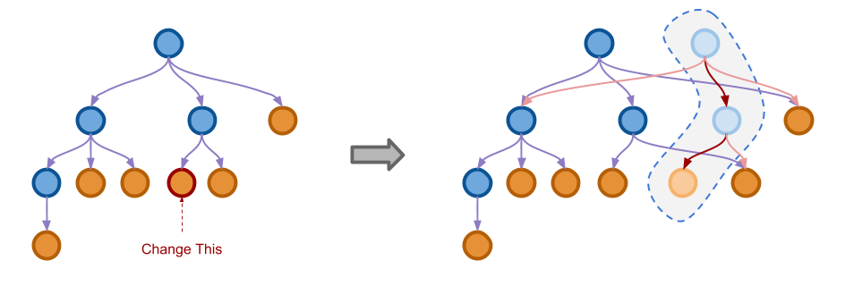

---
# try also 'default' to start simple
theme: default
# random image from a curated Unsplash collection by Anthony
# like them? see https://unsplash.com/collections/94734566/slidev
#background: images/immutable-tree-3061166569.png
# apply any windi css classes to the current slide
class: 'text-center'
# https://sli.dev/custom/highlighters.html
highlighter: shiki
# show line numbers in code blocks
lineNumbers: false
# some information about the slides, markdown enabled
info: |
  ## Slidev Starter Template
  Presentation slides for developers.

  Learn more at [Sli.dev](https://sli.dev)
# persist drawings in exports and build
drawings:
  persist: false
# use UnoCSS (experimental)
css: unocss
---

<style>
h1 {
  color: white;
  text-shadow: 2px 2px 4px #000000;
}
.imageText {
  font-size: 1.8rem;
  background-color: rgba(0, 0, 0, 0.2);;
  text-align: center;
  text-shadow: 2px 2px 4px #000000;
}
</style>

# Immutable Data Structures


---

# Immutable Data Structures talks series
1) **Basic Immutable Data Structures**
   - why, how, structural sharing
   - tuples, records, classes
   - Linked list (F# list)
   - Tree (F# Set, Map)
2) **Immutable Data Structures in C#**
   - ReadOnly vs. Immutable vs. Frozen
   - ImmutableList, LinkedList
   - ImmutableDictionary, ImmutableHashSet, ImmutableSortedSet
   - benchmarks, notes
3) **Working with Immutable Data Structures**
   - F# List
   - F# Map and Set
   - C# builder pattern
   - F# Seq, C# IEnumerable
   - Lazy
   - Structural comparison
   - Referential transparency

#### REMOVE In this talk
TODO
* Immutable Data Structures - why, how, Structural sharing
* F# List
* F# Map
* F# Set
* Structural comparison
* Comparison with C# collections
* IEnumerable, seq - lazy sequences
* referential transparency

---

# **PART 1**

---

# Immutable Data Structures
* no part of object can be changed after it's created

## Why?
* mutation is common source of bugs
* immutable data structures are easier to reason about
  - value passed to a function, can't be changed
* immutable data structures are thread-safe
* bonus: memory efficient time traveling

---

MYTH: to create new immutable value, you need to copy the whole thing

<Transform :scale="0.8">

</Transform>

---

# How?
* we can share parts of the structure between old and new value
* **Structural sharing**


---

## Records

- Immutable by default
- No special immutable structure
- Update syntax create new record with not-changed fields shared with old record
  - only reference is copied (except for structs)

---

## F# (Linked) list

```fsharp
let listA = [1; 2; 3]
let listA = 1 :: 2 :: 3 :: []
```


---

## F# (Linked) list sharing

```fsharp
let listA = [1; 2; 3]
let listA = 1 :: 2 :: 3 :: []
let listA2 = listA
let listB = 4 :: listA
let listB2 = [4] @ listA
```


---


---

# F# Set
Unordered set of values

Internally implemented as a (balanced) tree

```fsharp
let s = [11; 20; 29; 32; 41; 50; 65; 72; 91; 99] |> set
```


---

Insert = search + add

```fsharp
let s2 = s |> Set.add 35
```


from https://visualgo.net/en/bst

---

```fsharp
let s = [1; 7; 3; 9; 5; 6; 2; 8; 4] |> set
```


from https://visualgo.net/en/bst

---

# F# Map
* Dictionary like immutable data structure
* Like `Set`, but with value linked with each key (node)

---

```fsharp
let mapA = Map.ofList [1, "A"; 2, "B"; 3, "C"]
let mapB = Map.ofList [1, "A"; 2, "B"; 3, "C"; 4, "D"]
let mapB2 = Map.add 4 "D" mapA
mapB = mapB2 // true
```

---

# Structural comparison

- definition of equality based on values, not references
- all F# data types have defined structural comparison and ordering
- only few C# (compound) types have defined structural comparison and ordering
  - Tuples, Records, Array, ImmutableArray
- Immutability and structural comparison are different features, but it is common that immutable data structures have defined structural comparison
  - same value with different references are more common when working with immutable data structures

---

# PART 2 - C# Immutable collections

---

# terminology

- **Mutable** (a.k.a read/write): a collection or type that allows for in-place updates that anyone with a reference to that object may observe.
- **Immutable**: a collection or type that cannot be changed at all, but can be efficiently mutated by allocating a new collection that shares much of the same memory with the original, but has new memory describing the change.
- **Freezable**: a collection or type that is mutable until some point in time when it is frozen, after which it cannot be changed.
- **Read only**: a reference whose type does not permit mutation of the underlying data, which is usually mutable by another reference.

> source: https://devblogs.microsoft.com/premier-developer/read-only-frozen-and-immutable-collections/

---

# ImmutableList
TODO

---

# LinkedList
TODO

---

# ImmutableDictionary
TODO

---

# ImmutableHashSet
TODO

---

# ImmutableSortedSet, ImmutableSortedDictionary
TODO

---

# F# / C# naming

<style scoped>
table {
  font-size: 30px;
}
</style>

Collection | F# | C#
--- | --- | ---
Linked list | `list<'T>` | `LinkedList<T>`
Resizable array | `ResizeArray<'T>` | `List<T>`
Array | `array<'T>`, `'T[]` | `T[]`
Map (immutable dictionary) | `Map<'K, 'V>` | `ImmutableDictionary<K, V>`
Set (immutable set) | `Set<'T>` | `ImmutableHashSet<T>`
Dictionary (mutable) | - | `Dictionary<K, V>`
HashSet (mutable) | - | `HashSet<T>`
Enumerable | `seq<'T>` | `IEnumerable<T>`

---

# Other useful C# collections

* `Queue<T>`
* `PriorityQueue<T>`
* `ConcurrentDictionary<K, V>`

#### [REMOVE] C# Immutable collections

---

* Immutable collections are persistent data structures for C# from .NET 7
* `ImmutableList<T>` is indexable, represented as tree (similar to `Map<int, T>`)
* `ImmutableArray<T>` copying whole array on change (!)
* `ImmutableDictionary<K, V>` is similar to `Map<K, V>`
* `ImmutableStack<T>` is actually linked list - similar to `list<T>`
* `ImmutableQueue<T>` - no std. F# equivalent\

https://learn.microsoft.com/en-us/archive/msdn-magazine/2017/march/net-framework-immutable-collections

---

# ImmutableList benchmarks

|                                     Method |       Mean |     Error |    StdDev |    Gen0 |   Gen1 | Allocated |
|--- |-----------:|----------:|----------:|--------:|-------:|----------:|
|                          **'int - List cons'** |   2.375 us | 0.0473 us | 0.1059 us |  2.5482 | 0.4234 |   32000 B |
|                 'int - ImmutableList cons' |  95.410 us | 1.7462 us | 1.6334 us | 40.0391 | 9.6436 |  502896 B |
|                       **'int - List.reverse'** |   2.511 us | 0.0413 us | 0.0606 us |  2.5482 | 0.4234 |   32000 B |
|              'int - ImmutableList.reverse' |  71.121 us | 0.6854 us | 0.6411 us |  3.7842 | 0.8545 |   48024 B |
|                           **'int - List.map'** |   2.781 us | 0.0543 us | 0.0687 us |  2.5482 | 0.5074 |   32000 B |
|   'int - ImmutableList map by LINQ Select' |  31.375 us | 0.5986 us | 0.7571 us |  4.1504 | 0.9766 |   52200 B |
|       'int - ImmutableList map by SetItem' | 113.180 us | 2.1415 us | 2.4661 us | 36.2549 |      - |  455376 B |
|       'int - ImmutableList map by Builder' |  36.315 us | 0.6762 us | 0.6944 us |  3.7842 | 1.0376 |   48072 B |
|                        **'int - List.filter'** |   1.756 us | 0.0350 us | 0.0623 us |  1.2741 | 0.1411 |   16000 B |
| 'int - ImmutableList filter by LINQ Where' |  13.979 us | 0.2794 us | 0.3825 us |  2.2736 | 0.2747 |   28672 B |
|  'int - ImmutableList filter by RemoveAll' |  57.953 us | 0.9039 us | 0.8455 us |  2.3804 | 0.2441 |   30376 B |
|                        **'int - List.reduce'** |   1.095 us | 0.0148 us | 0.0138 us |       - |      - |         - |
|               'int - ImmutableList.reduce' |   4.495 us | 0.0656 us | 0.0806 us |  0.0076 |      - |     112 B |
|                      **'int - List.contains'** |   5.087 us | 0.0649 us | 0.0607 us |       - |      - |      40 B |
|             'int - ImmutableList.contains' |  12.743 us | 0.1634 us | 0.1448 us |       - |      - |      72 B |

---

# Enumerable, seq - lazy sequences

* Every collection implements `seq<'T>` (alias for `IEnumerable<T>`) interface.

* Interface for reading elements one by one.

* Lazy abstraction - elements are computed on demand.

---

## `seq<'t>`

```fsharp
xs |> Seq.map (fun x -> expensiveFun x) |> Seq.take 10 |> Seq.toList
```

Only first 10 elements are computed.

```fsharp
xs |> Seq.filter (...) |> Seq.map (fun x -> expensiveFun x) |> Seq.tryFind (...)
```

Only elements that pass the filter are computed.

---

## `seq<'t>`

There are cases where using `Seq` can be faster than `List`.

Example: expensive filtering and then taking first *k* elements.

```fsharp
xs |> Seq.filter (fun x -> expensiveFun x) |> Seq.take k |> Seq.toList
```

---

## Infinite sequences

Seq can be also used for generating (possible infinite) sequences.

```fsharp
let cycle xs =
    let arr = Array.ofSeq xs
    Seq.initInfinite (fun i -> arr.[i % arr.Length])
```

Or sequence of random numbers:

```fsharp
let r = System.Random()
Seq.initInfinite (fun _ -> r.Next())
```

---

# PART 3

---

# F# list performance

## F# list type definition

```fsharp
type List<'T> = 
| ([]) : 'T list
| ( :: ) : Head: 'T * Tail: 'T list -> 'T list
```

equivalently

```fsharp
type List<'T> = 
| Nil : 'T list
| Cons : Head: 'T * Tail: 'T list -> 'T list

let listA = Cons(1, Cons(2, Cons(3, Nil)))
```

---

## F# list performance

* fast iteration, mapping, filtering, append to start
* slow indexing, append on end
* `x :: xs` super fast
* `xs @ ys` slow

---

```fsharp
    [<Benchmark>]
    member _.ListAddToEnd() =
        let rec go i acc =
            if i = 0 then acc
            else go (i - 1) (acc @ [i])
        go size []

    [<Benchmark>]
    member _.ListAddToEndAcc() =
        let rec go i acc =
            if i = 0 then acc
            else go (i - 1) (i :: acc)
        go size [] |> List.rev
```

---

|          Method |        Mean |      Error |     StdDev |
|---------------- |------------:|-----------:|-----------:|
|    ListAddToEnd | 5,178.36 us | 102.125 us | 139.790 us |
| ListAddToEndAcc |    15.99 us |   0.308 us |   0.303 us |

* List.rev is fast!

---

# F# Set performance

## F# Set type definition

```fsharp
    (* A classic functional language implementation of binary trees *)

    [<CompilationRepresentation(CompilationRepresentationFlags.UseNullAsTrueValue)>]
    [<NoEquality; NoComparison>]
    type SetTree<'T> when 'T: comparison = 
        | SetEmpty                                          // height = 0   
        | SetNode of 'T * SetTree<'T> *  SetTree<'T> * int    // height = int 
        | SetOne  of 'T                                     // height = 1   
```

```fsharp
SetNode(41, SetNode(20, SetOne(11), SetNode(29, SetEmpty, SetOne(32), 1), 2), SetNode(65, SetOne(50), SetNode(91, SetOne(72), SetOne(99), 1), 2), 3)
```

---

## search, indexing


* `List.find`, `List.nth` goes through list one by one
* `Set` is better for searching in big lists
* if you really need indexing, use array

---

* values must be comparable
* searching for item (`Set.exists`, `Set.contains`) by binary search
* insert, remove - unchanged part of tree is shared

* functions with predicate on value (`Set.map`, `Set.filter`, `Set.partition`), goes through whole tree! (in order)
* keys cannot be duplicate - insert (`Set.add`) replace value if key already exists

---

## When to use Set instead of List?

* generally its faster to search for item with `Set`
* but for small sizes `List.contains` is faster

---

## When to use Set instead of List?

<style scoped>
table {
  font-size: 22px;
}
</style>

|       Method | Size |          Mean |       Error |      StdDev |
|------------- |----- |--------------:|------------:|------------:|
| **ListContains** |   **64** |      **2.159 μs** |   **0.0431 μs** |   **0.0998 μs** |
|  SetContains |   64 |      4.561 μs |   0.0833 μs |   0.0780 μs |
| **ListContains** |  **128** |      **8.241 μs** |   **0.0473 μs** |   **0.0443 μs** |
|  SetContains |  128 |     10.347 μs |   0.1933 μs |   0.1985 μs |
| **ListContains** |  **256** |     **31.169 μs** |   **0.1609 μs** |   **0.1426 μs** |
|  SetContains |  256 |     23.488 μs |   0.3803 μs |   0.3557 μs |
| **ListContains** |  **512** |    **119.456 μs** |   **0.5491 μs** |   **0.5136 μs** |
|  SetContains |  512 |     52.889 μs |   0.8146 μs |   0.6802 μs |
| **ListContains** | **1024** |    **467.593 μs** |   **1.9139 μs** |   **1.7902 μs** |
|  SetContains | 1024 |    149.908 μs |   1.2287 μs |   1.1494 μs |
| **ListContains** | **8192** | **29,487.104 μs** | **114.3813 μs** | **101.3960 μs** |
|  SetContains | 8192 |  1,548.127 μs |  19.6668 μs |  18.3963 μs |

---

## Another important functions
* `Set.union`
* `Set.intersect`
* `Set.difference`

* all of them work recursively on tree structure -> faster than the same on `list`

* `Set.isSubset`
* `Set.isSuperset`

* try to find all elements of first set in second

---

# F# Map performance

## F# Map type definition

```fsharp
[<NoEquality; NoComparison>]
[<AllowNullLiteral>]
type internal MapTree<'Key, 'Value>(k: 'Key, v: 'Value, h: int) =
    member _.Height = h
    member _.Key = k
    member _.Value = v
    new(k: 'Key, v: 'Value) = MapTree(k, v, 1)

[<NoEquality; NoComparison>]
[<Sealed>]
[<AllowNullLiteral>]
type internal MapTreeNode<'Key, 'Value>
    (
        k: 'Key,
        v: 'Value,
        left: MapTree<'Key, 'Value>,
        right: MapTree<'Key, 'Value>,
        h: int
    ) =
    inherit MapTree<'Key, 'Value>(k, v, h)
    member _.Left = left
    member _.Right = right
```

---

## F# Map performance

* keys must be comparable
* searching for item (`Map.find`, `Map.containsKey`) by binary search
* insert, remove - unchanged part of tree is shared

* functions with predicate on key (`Map.pick`, `Map.findKey`), goes through whole tree! (in keys order)
* keys cannot be duplicate - insert (`Map.add`) replace value if key already exists

---

## F# Map performance

Creation of `Map` - List.groupBy

```fsharp
[1..1000] |> List.groupBy (fun x -> x % 100) |> Map.ofList
```

---

# Structural equality

## F# data types
* unit
* primitive types - `int`, `float`, `string`, `bool`, ...
* records
* tuples
* discriminated unions

## composed types

* `list`
* `Set`
* `Map`

all F# data types have defined structural equality and ordering - can be used in `Set` and `Map`

---

# Ordering
Ordering by field/case position, then recurse or prim. type ordering

```fsharp
type R = {A: int; B: string}
{A = 1; B = "b"} < {A = 2; B = "a"}
{A = 1; B = "a"} = {A = 1; B = "a"}
{A = 1; B = "a"} < {A = 1; B = "b"}

type R2 = {B: string; A: int}
{B = "b"; A = 1} > {B = "a"; A = 2}
{B = "a"; A = 2} > {B = "a"; A = 1}

("a", 1) < ("a", 2)
```

---

```fsharp
//DU - by order of cases

Some 1 < Some 2
None < Some System.Int32.MaxValue
```

(Ab)use of ordering example

```fsharp
type PokerHand =
    | HighCard of int
    | Pair of int
    | TwoPair of int * int
    | ThreeOfAKind of int
    | Straight of int
    | Flush of int
    | FullHouse of int * int
    | FourOfAKind of int
    | StraightFlush of int
    | RoyalFlush
```

---


# Referential transparency
* replace the function call with its result doesn't change meaning of the program
  - always returns the same result for the same input ("math-y" function)

* Immutable data structures allows us to write **Referential transparent** functions.

* no mutable variables / data structures, no side effects => **referential transparency**

---

* BUT:
* **referential transparency** can be achieved even with mutable data structures or side-effects
* mutable variables and data structures are perfectly fine when not leaking outside of function

---

```fsharp
    [<CompiledName("Fold")>]
    let fold<'T, 'State> folder (state: 'State) (list: 'T list) =
        match list with
        | [] -> state
        | _ ->
            let f = OptimizedClosures.FSharpFunc<_, _, _>.Adapt (folder)
            let mutable acc = state

            for x in list do
                acc <- f.Invoke(acc, x)

            acc
```

---

### Memoize function:

```fsharp
let memoizeBy projection f =
    let cache = System.Collections.Concurrent.ConcurrentDictionary()
    fun x -> cache.GetOrAdd(projection x, lazy f x).Value
```

---

# Pure functions

* **Pure** function:
    - always returns the same result for the same input (**referential transparency**)
    - no side effects

* no mutable variables / data structures, no side effects <=> **pure function**
* every **pure** function is **referential transparent**
* **pure function** is more strict, but can be checked by compiler - one of idea behind Haskell

---

# QUESTIONS?