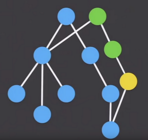
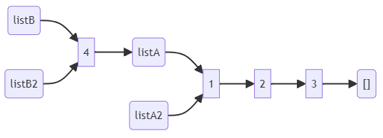
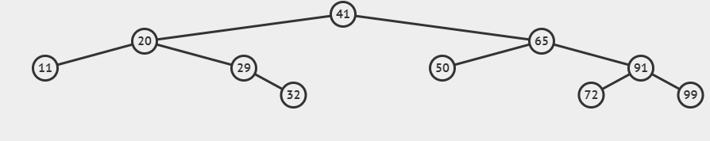

::date::
xx.yy.2024

::title::
# Immutable Data Structures

::description::
<!-- <div class="pb-6">Everything you need to know about, ....</div> -->
<div>Jindřich Ivánek</div>
<div>F# Developer at Ciklum</div>

---

# Immutable Data Structures
   - why, how, structural sharing
   - Linked list (F# list)
   - Tree (F# Set, Map)
   - tuples, records, classes

---

# Immutable Data Structures
* no part of object can be changed after it's created

## Why?
* mutation is common source of bugs
* immutable data structures are easier to reason about
  - value passed to a function, can't be changed
* immutable data structures are thread-safe
* bonus: memory efficient time traveling

---

MYTH: to create new immutable value, you need to copy the whole thing

<Transform :scale="0.8">

</Transform>

---

# How?
* we can share parts of the structure between old and new value
* **Structural sharing**



---


# (Linked) list

```fsharp
let listA = [1; 2; 3]
let listA = 1 :: 2 :: 3 :: []
```


---

## (Linked) list sharing

```fsharp
let listA = [1; 2; 3]
let listA = 1 :: 2 :: 3 :: []
let listA2 = listA
let listB = 4 :: listA
let listB2 = [4] @ listA
```



---


---

# Set
Unordered set of values

Typically implemented as a (balanced) tree

```fsharp
let s = [11; 20; 29; 32; 41; 50; 65; 72; 91; 99] |> set
```



---

## Insert = search + add

```fsharp
let s2 = s |> Set.add 35
```


from https://visualgo.net/en/bst

---

## Building new Set

```fsharp
let s = [1; 7; 3; 9; 5; 6; 2; 8; 4] |> set
```


from https://visualgo.net/en/bst

---

# Map
* Dictionary like immutable data structure
* Like `Set`, but with value linked with each key (node)

TODO image

---

## Map sharing

```fsharp
let mapA = Map.ofList [1, "A"; 2, "B"; 3, "C"]
let mapB = Map.ofList [1, "A"; 2, "B"; 3, "C"; 4, "D"]
let mapB2 = Map.add 4 "D" mapA
mapB = mapB2 // true
```

---

# Records

```fsharp
{ Id: int; Name: string }
```

- Immutable by default
- No special immutable structure
- Update syntax create new record with not-changed fields shared with old record
  - ```fsharp
    { oldRecord with Name = "Bob" }
    ```
  - only reference is copied (except for *structs*)

---

# Structural comparison in .NET

- definition of equality based on values, not references
- all F# data types have defined structural comparison and ordering
- only few C# (compound) types have defined structural comparison and ordering
  - Tuples, Records, Array, ImmutableArray
- Immutability and structural comparison are different features, but it is common that immutable data structures have defined structural comparison
  - same value with different references are more common when working with immutable data structures

---

# Questions?

---
layout: thank-you
---

# Thank you!

---